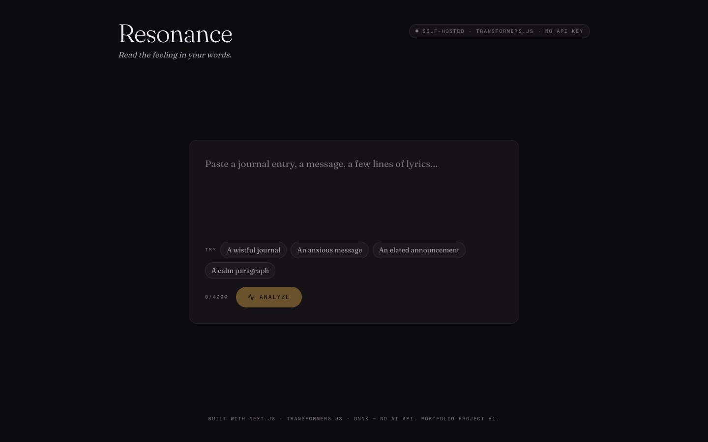

# Resonance

> Text → emotion spectrum from a real transformer running server-side. No AI API. Next.js + transformers.js + ONNX.

**[Live demo](https://resonance.ayoubalkak.com)** · part of [my portfolio](https://ayoubalkak.com)



**Read the feeling in your words.** A real transformer model runs inside our own
serverless function — no third-party API, no API key, zero per-request cost — and its
output literally paints the interface.

Resonance reads the emotion in a piece of text on its *own* server (via
[`@huggingface/transformers`](https://github.com/huggingface/transformers.js), ONNX in
Node), and renders the result as a calm, breathing **emotional spectrum** + a per-sentence
**emotional arc**, plus a precise instrument readout (latency, tokens, model id) that
proves the engine is real and fast. Portfolio Project **B1** — the first backend project.

## The model story (why this is not an API wrapper)

Most "AI sentiment" demos are a `fetch()` to a paid API wrapped in a spinner. Resonance is
not that. The differentiator:

- **The model runs in our function.** `app/api/analyze/route.ts` runs on the Node runtime
  and loads an ONNX transformer with `@huggingface/transformers` — server-side, in-process.
- **No API, no key, no per-request cost.** Nothing is sent to OpenAI/Anthropic/anyone.
- **The model is vendored.** It's committed to `models/` and traced into the function
  bundle (`next.config.ts` → `outputFileTracingIncludes`), so production cold-starts never
  wait on a network download.
- **The telemetry is the proof.** Latency (ms), token count, sentence count, model id and
  `backend: server · onnx · no-api` are real measurements, surfaced as a first-class part
  of the UI — never faked.

### Which model

**`SamLowe/roberta-base-go_emotions-onnx`** — a 28-label
[GoEmotions](https://github.com/google-research/google-research/tree/master/goemotions)
RoBERTa classifier, ONNX-exported and Transformers.js-compatible. It's **multi-label**
(sigmoid scores), so the whole text yields a rich *spectrum* of independent confidences
(joy, remorse, caring, fear, …) rather than one label, and each sentence is classified for
the arc. We load the **q8-quantized** weights (`onnx/model_quantized.onnx`, ~119 MB) for a
smaller bundle and faster CPU inference. Swappable via the `MODEL_ID` env var; the
emotion→color map in `lib/emotion/colors.ts` covers all 28 labels (+ a binary-sentiment
fallback and a grey default).

> **transformers.js v4 note:** to get *all* label scores, the pipeline option is
> **`top_k: null`** (snake_case) — `topk` silently returns only the top label.

## Getting started

```bash
npm install
npm run fetch-model            # download the model into ./models (~120MB, one-off)
npm run dev                    # http://localhost:3000
```

`npm run build` runs `fetch-model` automatically, and the fetch is **idempotent**: it
skips files that are already present and complete, and only re-downloads a file that is
missing or truncated. So returning to the project and rebuilding never re-downloads the
120MB weight; a fresh checkout (e.g. on Vercel) downloads it once.

Prove the engine runs offline (loads from the vendored copy, no network):

```bash
node scripts/prove-engine.mjs
```

Hit the API directly:

```bash
curl -X POST http://localhost:3000/api/analyze \
  -H 'content-type: application/json' \
  -d '{"text":"We got it. After months of rejections, they said yes."}'
```

## How it works

| Piece | File |
|-------|------|
| Model singleton (cached per warm Lambda on `globalThis`) | `lib/inference/pipeline.ts` |
| Analyze route (spectrum + arc + telemetry) | `app/api/analyze/route.ts` |
| Warm-up route (fired on first paint) | `app/api/analyze/warm/route.ts` |
| Sentence segmentation (dependency-free) | `lib/inference/segment.ts` |
| Emotion → color / accent | `lib/emotion/colors.ts` |
| Mood word + plain-language read | `lib/emotion/describe.ts` |
| Vibe (palette + free music search) | `lib/emotion/vibe.ts` |
| PNG fingerprint card | `lib/exportCard.ts` |
| Permalink encode/decode | `lib/urlState.ts` |
| Client store | `store/useResonanceStore.ts` |
| UI components | `components/` |

The frontend recolors the whole room to the dominant emotion (`--accent`), renders the
spectrum as breathing confidence bars, the arc as a per-sentence timeline, a derived vibe
(palette + free YouTube *search* link — no auth), and a live telemetry readout. Every
analysis becomes a **permalink** (text encoded in the URL hash → re-runs on load) and an
exportable **emotion-fingerprint card** (PNG).

## Deploy (Vercel)

The critical trio (PLAN §4.2) is already wired: model **traced** into the analyze lambda,
route on **`runtime = 'nodejs'`** with **`maxDuration = 60`**.

**The model is not committed to git.** The 120 MB ONNX weight exceeds GitHub's 100 MB
file limit, so `models/` is gitignored and fetched at build time instead: the `build`
script runs `scripts/fetch-model.mjs` (downloads from HuggingFace), then `next build`
traces the freshly-fetched files into the function. This keeps the normal
**push-to-GitHub → auto-deploy-on-Vercel** workflow with no Git LFS and no size limit.

```bash
git add -A && git commit -m "Resonance" && git push   # code only — no 120MB blob
# Vercel → New Project → import the repo → Deploy (no env vars needed)
```

Notes:
- **Runtime is fully offline** — HuggingFace is only contacted at *build* time; the
  bundled copy is loaded at request time.
- First build is ~1–2 min longer (the one-time model download).
- After deploy, smoke-test the live `/api/analyze` — this is where the real risk lives.

## Stack

Next.js 16 (App Router) · React 19 · TypeScript · Tailwind v4 · `@huggingface/transformers`
(ONNX, Node) · Zustand · Framer Motion · Fraunces + Geist Mono.

Built with Next.js · transformers.js · ONNX — **no AI API.**
